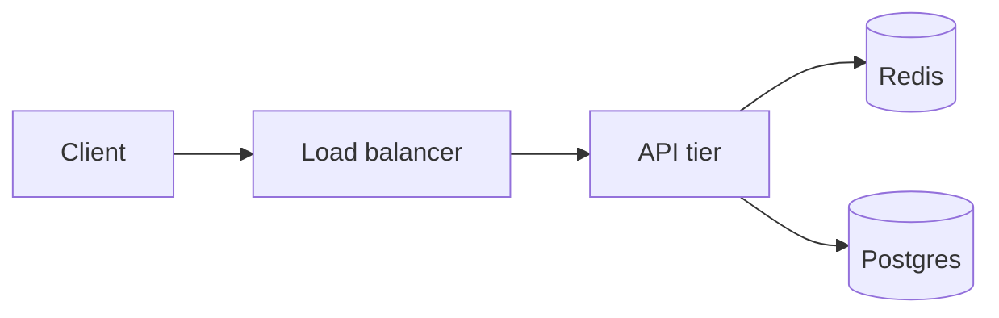

> Delete this file once you have a real entry. It exists to show every feature
> the layout supports. `draft: true` keeps it off the live site.

## Context

What the system does, its scale, and the constraint that made the problem hard.
Numbers here — RPS, p99 latency, data volume — are what separate this from a
generic blog post.

## Symptom

What was observed, in the order it was observed. Include the graph or the log
line that started the investigation.

## Architecture



## Diagnosis

The reasoning chain, including the hypotheses that turned out wrong. Those are
the parts other engineers actually learn from.

```ts
// Keep snippets short and self-contained; link to the PoC repo for the rest.
export async function withLease<T>(key: string, fn: () => Promise<T>): Promise<T> {
  const token = await acquire(key, { ttlMs: 5_000 });
  try {
    return await fn();
  } finally {
    await release(key, token);
  }
}
```

## Result

| Metric | Before | After |
| --- | --- | --- |
| p99 latency | 840 ms | 96 ms |
| Peak RSS | 6.2 GB | 1.1 GB |

## What I would do differently

The honest section. This is the one senior readers scroll to.
